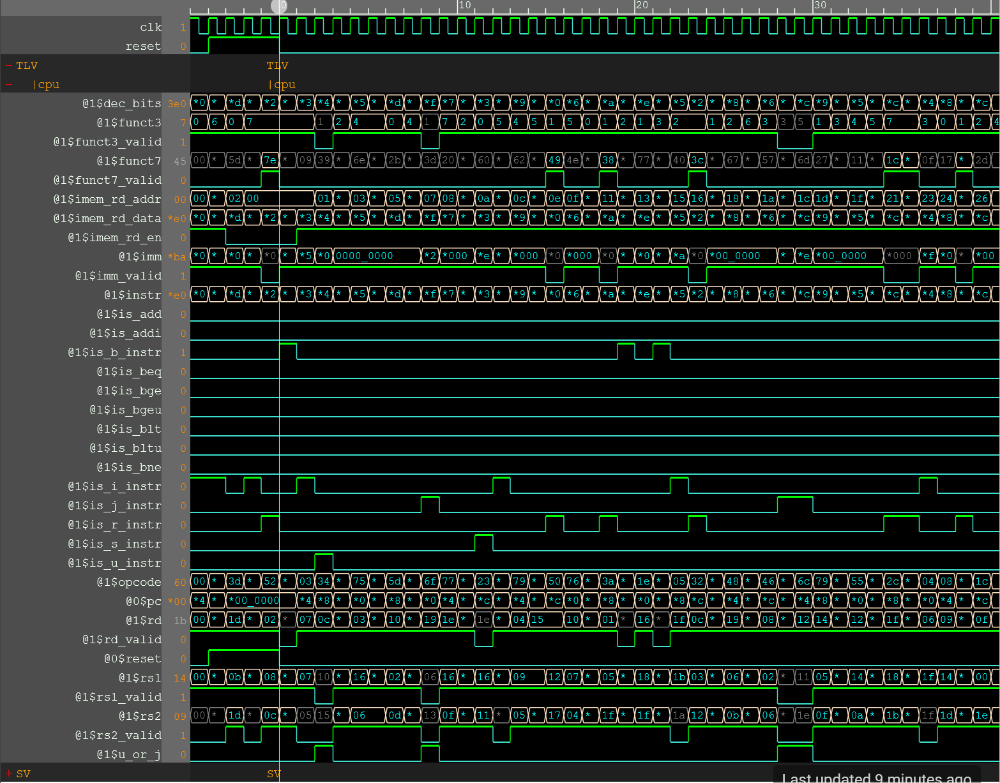
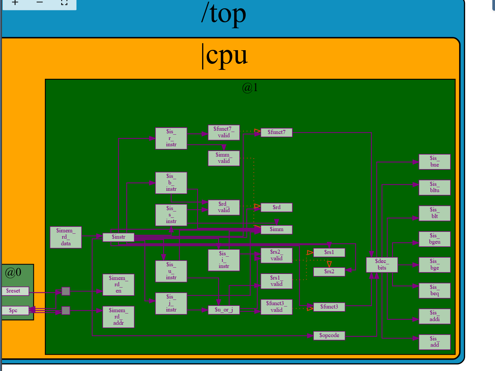

          # RV32I 4-Stage Pipelined Processor Core

A fully functional 4-stage pipelined RISC-V (RV32I) processor core designed using TL-Verilog. This project handles instruction decoding, immediate generation, register file interfacing, hazard bypassing, and control flow redirection.

## 🚀 Microarchitecture Overview
* **Stage 0 (@0):** Program Counter (PC) generation and branch target redirection.
* **Stage 1 (@1):** Instruction Fetch from memory and absolute Instruction Decoding (I, R, S, B, U, J types).
* **Stage 2 (@2):** Register file read operations and Data Hazard Bypassing logic.
* **Stage 3 (@3):** Arithmetic Logic Unit (ALU) execution, pipeline flushes, and Register File write-back.

## 📊 Simulation & Waveforms

### Waveform Analysis
Below is the screenshot of the core pipeline signals tracking accurately across execution cycles:

### Hardware Visualization
Below is the visual datapath tracking inside the Makerchip simulation environment:

## 🛠️ Key Architectural Features Implemented
* **Sign Extension Unit:** Dynamically decodes fractured immediate pieces across varied instruction lengths.
* **Hazard Bypass Network:** Resolves Read-After-Write (RAW) data hazards by forwarding results from 2 cycles ahead directly back to the ALU operands.
* **Pipeline Flush Control:** Automatically invalidates skipped instructions during taken branch paths to preserve register state integrity.
